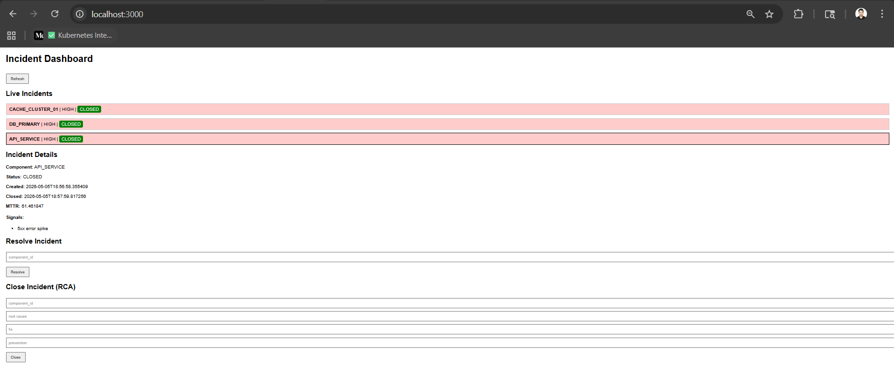

# Incident Management System (IMS)

## Overview

This project implements a resilient Incident Management System designed to handle high-throughput signals from distributed systems and manage the full incident lifecycle with mandatory Root Cause Analysis (RCA).

The system simulates real-world production scenarios where large volumes of signals are ingested, processed asynchronously, and converted into actionable incidents.

---

## Architecture

### Architecture Diagram

Client → FastAPI → Rate Limiter → Async Queue → Worker
↓
Debounce Engine
↓
Incidents DB (Source of Truth) | Signals DB (Audit Log)
↓
Frontend Dashboard

---

## Dashboard Preview



---

## Repository Structure

ims-project/
├── backend/        (FastAPI service)
├── frontend/       (UI dashboard via Nginx)
├── docs/           (design, testing, backpressure)
├── scripts/        (simulation scripts)
├── sample_data.json
├── docker-compose.yml
└── README.md

---

## Features

* Async signal ingestion using asyncio.Queue
* Handles burst traffic efficiently
* Debounce logic (10-second window per component)
* Incident lifecycle:
  OPEN → INVESTIGATING → RESOLVED → CLOSED
* Mandatory RCA before closing incidents
* MTTR (Mean Time To Repair) calculation
* Rate limiting (50 requests / 10 sec per IP)
* Health endpoint for observability
* Live dashboard UI

---

## Tech Stack

* Python (FastAPI)
* Uvicorn
* Docker & Docker Compose
* Nginx (Frontend)
* In-memory storage (simulating NoSQL + cache)

---

## How to Run

```bash
docker-compose up --build
```

### Access

* Frontend UI: http://localhost:3000
* Backend API Docs: http://localhost:8000/docs

---

## API Endpoints

### Health

GET /health

### Signal Ingestion

POST /signal

Example:

```json
{
  "component_id": "db1",
  "severity": "high",
  "message": "Database failure"
}
```

### Data Retrieval

GET /signals
GET /incidents

### Incident Workflow

POST /incident/{component_id}/resolve
POST /incident/{component_id}/close

---

## Backpressure Handling

The system is designed to handle burst traffic without failure.

* Uses asyncio.Queue to buffer incoming signals
* Worker processes signals asynchronously
* API remains responsive under load
* Rate limiting prevents overload
* Debounce logic reduces duplicate incidents

### Trade-offs

* In-memory queue is fast but not durable
* Single worker limits scalability
* Can be extended using Kafka or Redis

---

## Simulation

Run failure simulation:

```bash
python scripts/simulate_failure.py
```

This generates burst traffic and validates async processing and debounce behavior.

---

## Testing

* Verified signal ingestion and incident creation
* Validated lifecycle transitions
* Negative testing:

  * Close without resolve → rejected
  * Close without RCA → rejected
* UI testing for real-time updates

---

## Design Patterns Used

* Producer-Consumer Pattern → Async queue
* State Machine Pattern → Incident lifecycle
* Sliding Window Pattern → Debounce logic
* Middleware Pattern → Rate limiting

---

## Observability

GET /health provides:

* signals_processed
* active_incidents
* queue_size

---

## Limitations

* In-memory storage (no persistence)
* Single worker (not horizontally scalable)
* No external message broker

---

## Design Decisions

* Async queue chosen to handle burst traffic
* Debounce prevents alert flooding
* In-memory storage for simplicity and speed
* System designed for easy extension to distributed systems

---

## Future Improvements

* Integrate Kafka or Redis
* Add PostgreSQL for persistence
* WebSocket-based real-time UI
* Alerting (Email/Slack)
* Horizontal scaling

---

## Conclusion

This project demonstrates:

* Handling high-throughput distributed signals
* Async processing and backpressure control
* Incident lifecycle enforcement with RCA validation
* Clean and extensible system design

---

⭐ Built as part of an engineering challenge to simulate production-grade incident management systems.

